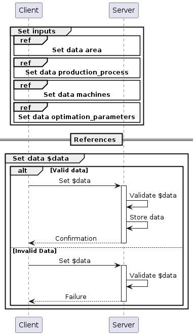
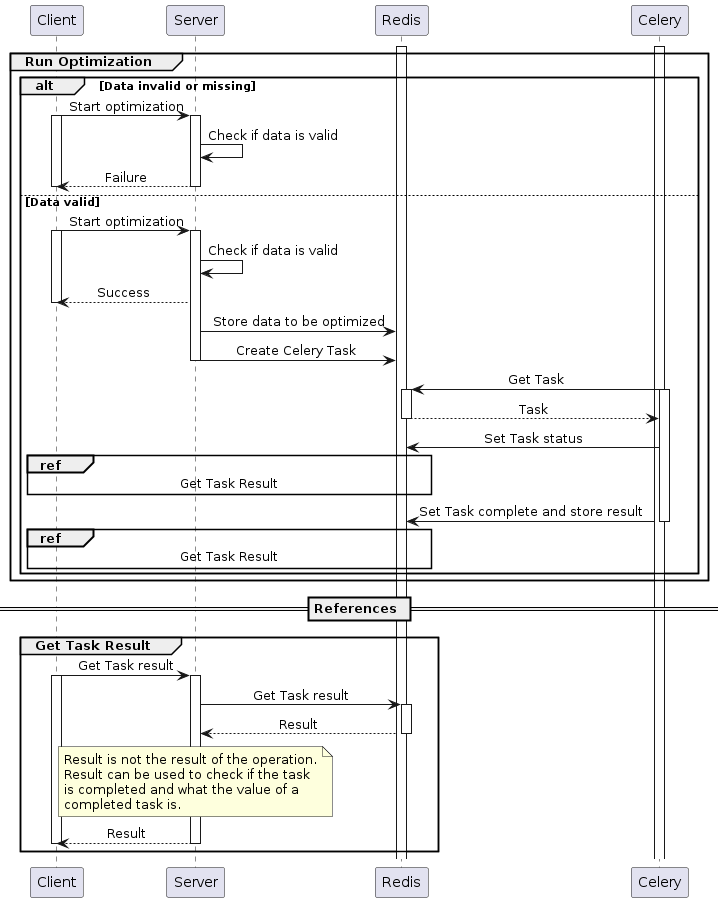

# FLP Documentation <!-- omit in toc -->

This documentation aims to give a basic introduction to the architecture of the FLP application. It's written in the arc42 style.

## Contents <!-- omit in toc -->

- [1. Introduction and Goals](#1-introduction-and-goals)
- [2. Constraints](#2-constraints)
- [3. Context and Scope](#3-context-and-scope)
- [4. Solution Strategy](#4-solution-strategy)
- [5. Building Block View](#5-building-block-view)
  - [5.1 Whitebox Overall System](#51-whitebox-overall-system)
  - [5.2 Backend](#52-backend)
  - [5.3 Frontend](#53-frontend)
- [6. Runtime View](#6-runtime-view)
- [7. Deployment View](#7-deployment-view)
- [8. Crosscutting View](#8-crosscutting-view)
- [9. Architectural Decisions](#9-architectural-decisions)
- [10. Quality Requirements](#10-quality-requirements)
- [11. Risks and technical debt](#11-risks-and-technical-debt)
- [12. Glossary](#12-glossary)

# 1. Introduction and Goals

This document describes the FLP webapplication, short FLP, which is a web-based frontend for an application optimizing production line planning.

It is used to collect input on:
- the dimensions of the facility
- the sequence of production processes
- the machines used in the production facility
- the optimisation parameters

It then starts the optimisation. When the results of the optimisation are available they are displayed and can be altered by the user.

The following goals have been established for FLP:

| Priority | Goal |
| :------: | ---- |
| 1 | Provide an easy to use interface for interacting with the optimisation application |
| 2 | Ability to be used concurrently by different devices |
| 3 | Be easily maintainable | 

The following key features of the software have been identified:

- **Easily usable data input/output interfaces**\
  The purpose of this software is providing an easy to use interface for interacting with the optimisation application

- **Maintainability**\
  This software might be expanded on or combined with other softwares in the future, which makes maintainability an important goal. There are also plans to use it in conjunction with lectures so it has a high life expectancy, which also is a factor for the importance of maintainability

- **Consistent design**\
  A consistent design improves the usability of an application and makes it feel more professional

# 2. Constraints

FLP should be:

- able to run locally or on a server
- use Flask for the backend webapplication
- able to start the optimization application from the backend with data from the frontend
- use Vue for the frontend

# 3. Context and Scope

<!--This section defines the FLP webapplication in the business context (interactions with communication partners) and in the technical context (technical interfaces with the environment).

 ## 3.1 Process context

](uml_diagrams/images/Process_context.png)

| Neighbor | Description |
| - | - |
| optimization | Generates an optimized production line plan from JSON data. |
| user | Creates an optimized production line plan. |

## 3.2 Technical context -->

The following diagram gives a basic overview over the technical parts of the system and their technical connections.

](uml_diagrams/images/Technical_context.png)

| Node/Artifact | Description |
| - | - |
| Docker | Manages the docker containers and forwards the ports. |
| Celery | Executes long-running background tasks (the optimization) and stores the result in redis. |
| webapp | Validates and stores input data from the UserComputer, can be promped for status updates and results of a process run. |
| redis | Key-Value-Store that is also used for storing the background tasks to be executed. |
| optimization | Generates an optimized production line plan from JSON data. |
| UserComputer | The users computer. |

# 4. Solution Strategy

1. Split the application into two parts:
     - a frontend (implemented in Vue) which is responsible for getting the input from the user and displaying the output of the optimization application to the user
     - a backend which deals with calling the optimization application and storing results
2. Remove the execution of the optimization from the backend webapplication process so that the process isn't blocked for 30 minutes when an optimization is started.
3. Use Celery (with Redis) for the execution of the optimization process instead and connect it with the backend webapplication.
4. Use docker compose and docker containers to reduce the complexity of the setup of the backend infrastructure to a single command. 

# 5. Building Block View

The building block view shows the static decomposition of the system into building blocks (modules, components, subsystems, classes, interfaces, packages, libraries, frameworks, layers, partitions, tiers, functions, macros, operations, data structures, ...) as well as their dependencies (relationships, associations, ...)

## 5.1 Whitebox Overall System

The following UML package diagram shows the systems top level as a whitebox.

 as code.](uml_diagrams/images/System_Whitebox.png)

| Subsystem | Description |
| - | - |
| Backend | Is responsible for executing the optimization. |
| Frontend | Manages the user UI and its events. |

The communication between the two subsystems is defined using OpenAPI in [this file](../backend/openapi.yaml).

## 5.2 Backend

## 5.3 Frontend

# 6. Runtime View

# 7. Deployment View

 for a detailed overview.](uml_diagrams/images/Infrastruktur.png)

# 8. Crosscutting View

# 9. Architectural Decisions

# 10. Quality Requirements

| Quality Category | Quality | Description | Scenario |
|-|-|-|-|
| Usability | Ease of Use | The User Interface should be easy enough to understand that no handbook needs to be used | S1 | 
| Performance | Reliability | Unit tests should be used to guarantee reliability of the source code | S2 | 
| Performance | Robustness | Robust error-handling should be implemented | S3 | 
| Maintainability & Support | Difficulty (source code) | The source code should be easy to understand | S4 |
| Maintainability & Support | Documentation | The source code should be well documented | S5 |

| ID | Szenario |
|-|-|
| S1 | A person who has never used this software before should be able to use it to create a optimized plan without consulting a handbook for the functionality of the software. |
| S2 | Logical source code application should be tested by unit tests to guarantee reliability. |
| S3 | The application should be able to deal with errors in a way that they can be detected and resolved by a user or administrator of the application. |
| S4 | Familiarising oneself with parts of the source code should be possible in a short timeframe regardless of prior exposure to the source code. |
| S5 | The source code should be documented by this documentation and documentation on folder, file, class, function level. |

# 11. Risks and technical debt

# 12. Glossary

